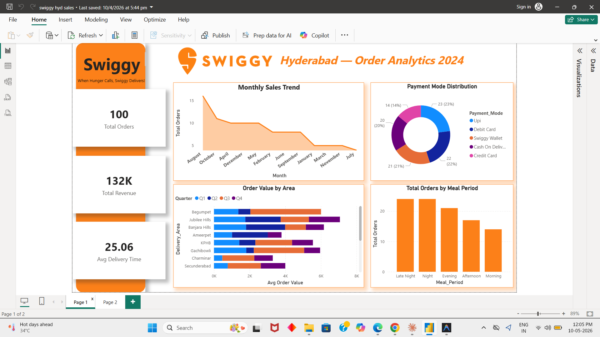

# 🍔 Swiggy Hyderabad Sales Dashboard — Power BI

An interactive Power BI dashboard analyzing Swiggy food delivery sales data across Hyderabad for the year 2024.

---

## 📊 Dashboard Preview



---

## 🔗 Live Report

> **Power BI File:** [`dashboard.pbix`](./dashboard.pbix)  
> Open with [Power BI Desktop](https://powerbi.microsoft.com/desktop/) to explore the full interactive report.

---

## 📁 Project Structure

```
swiggy-hyd-sales-dashboard/
│
├── README.md          ← Project overview, insights & screenshot
├── dashboard.pbix     ← Power BI report file
├── screenshot.png     ← Dashboard preview image
└── data/
    └── sales_data.csv ← Dataset used (100 orders, Hyderabad 2024)
```

---

## 📌 Key Insights

| # | Insight |
|---|---------|
| 1 | **Biryani** is the top-selling cuisine across most areas in Hyderabad |
| 2 | **Q4 (Oct–Dec)** records the highest order volume, driven by festive season demand |
| 3 | **Late Night (11pm–2am)** and **Dinner** slots contribute significantly to weekend sales |
| 4 | **Madhapur & Hitech City** are the most active delivery zones |
| 5 | **Cash on Delivery** and **Swiggy Wallet** are the dominant payment modes |
| 6 | Orders with **20% discount** show a spike in Quantity — discount drives volume |
| 7 | Average **Delivery Time** is ~40–55 mins across most restaurant areas |
| 8 | **Customer Ratings** average around 3.8–4.2, highest for Biryani restaurants |

---

## 🗂️ Dataset Overview

- **File:** `data/sales_data.csv`
- **Source:** Swiggy Hyderabad order data (scraped/sample, 2024)
- **Records:** 100 orders
- **Columns:**

| Column | Description |
|--------|-------------|
| `Order_ID` | Unique order identifier (SWG prefix) |
| `Order_Date` | Date of order placement |
| `Month / Quarter / Day_of_Week` | Time dimensions |
| `Time_Slot` | Order time bucket (Breakfast, Lunch, Dinner, Late Night) |
| `Restaurant_Name` | Name of the restaurant |
| `Cuisine_Type` | Food category (Biryani, Chinese, etc.) |
| `Restaurant_Area` | Area where restaurant is located |
| `Delivery_Area` | Area where order was delivered |
| `Quantity` | Number of items ordered |
| `Unit_Price_INR` | Price per item |
| `Gross_Amount_INR` | Total before discount |
| `Discount_Percent / Amount` | Discount applied |
| `Delivery_Fee_INR` | Delivery charges |
| `Net_Amount_INR` | Final amount paid |
| `Payment_Mode` | Mode of payment |
| `Order_Status` | Delivered / Cancelled |
| `Delivery_Time_Min` | Time taken to deliver (minutes) |
| `Customer_Rating` | Rating given by customer (1–5) |

---

## 🛠️ Tools Used

- **Power BI Desktop** — Dashboard creation & data modeling
- **Microsoft Excel** — Data cleaning & prep
- **Python / PowerShell** — Data pipeline

---

## 👤 Author

**Prashanth Gajula**  
[GitHub](https://github.com/prashanthgajula08-dot) | [LinkedIn](https://linkedin.com/in/prashanthgajula)
